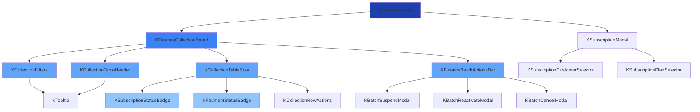
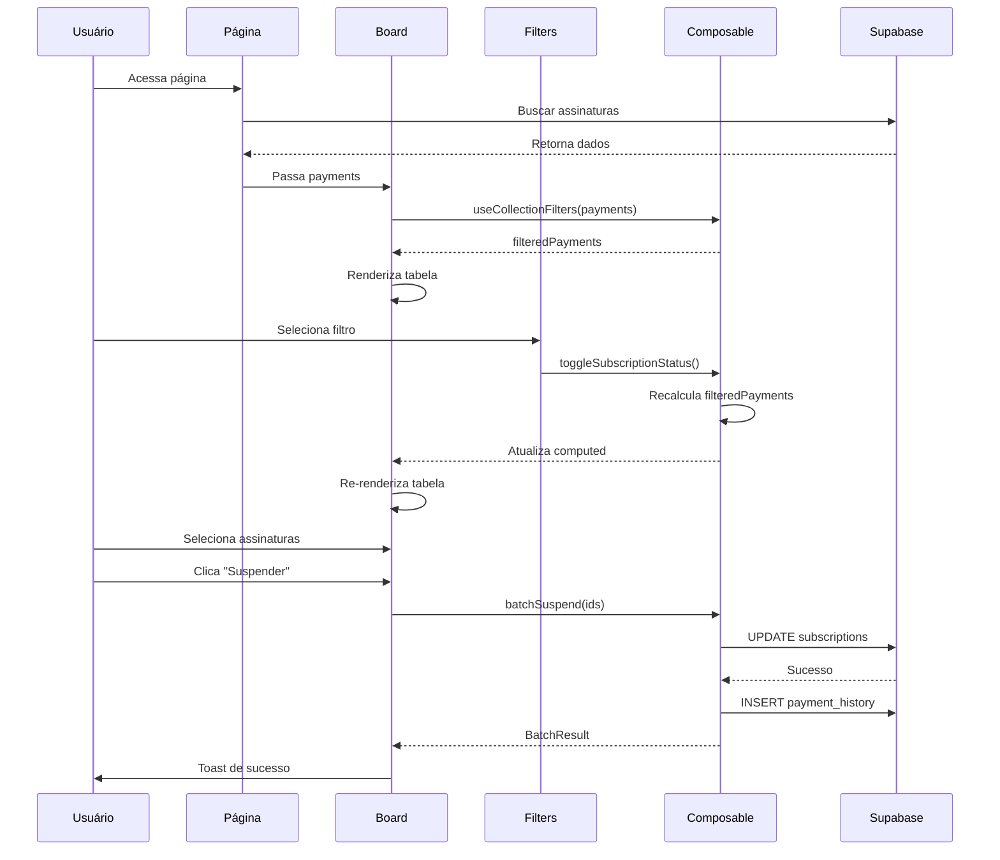
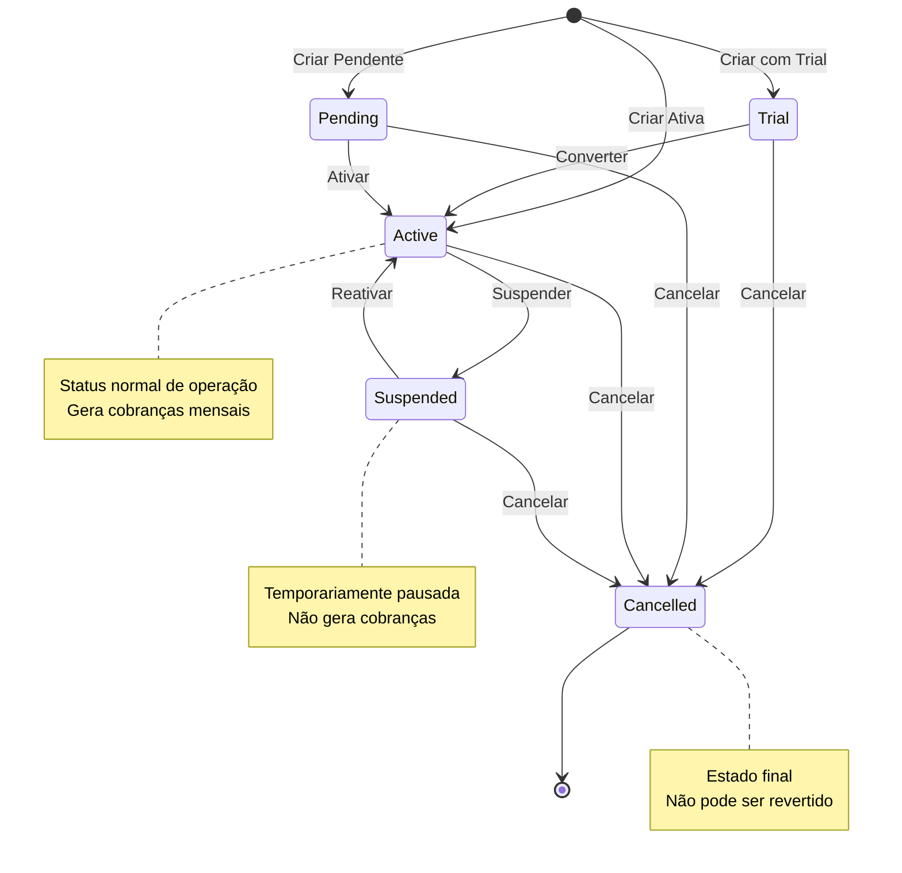
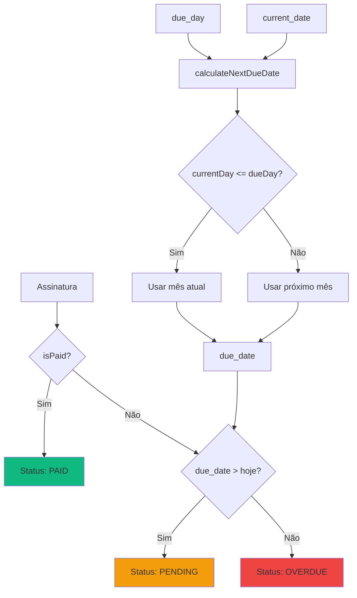
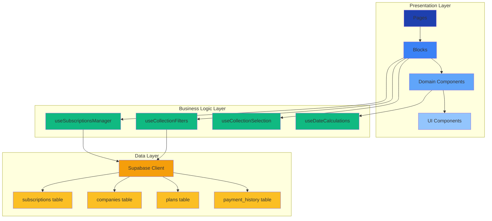

# Design Técnico: Reforma do Sistema de Assinaturas e Cobranças

## Visão Geral

Este documento detalha o design técnico para a reforma completa do sistema de assinaturas e cobranças, com foco em **componentização total**, separação clara de responsabilidades e arquitetura escalável.

### Objetivos

- Separar claramente conceitos de ASSINATURA (contrato) vs COBRANÇA (pagamento)
- Eliminar confusões de nomenclatura através de componentes especializados
- Criar arquitetura componentizada e reutilizável
- Implementar composables para lógica de negócio
- Melhorar UX com componentes visuais claros

### Princípios de Design

1. **Componentização Total**: Cada funcionalidade em seu próprio componente
2. **Separação de Responsabilidades**: UI separada de lógica de negócio
3. **Composables First**: Lógica reutilizável em composables
4. **Tipagem Forte**: TypeScript em todos os componentes
5. **Reatividade**: Vue 3 Composition API

## Arquitetura

### Estrutura de Camadas

```
┌─────────────────────────────────────────┐
│         Páginas (Pages)                 │
│  - assinaturas.vue                      │
└─────────────────────────────────────────┘
              ↓
┌─────────────────────────────────────────┐
│    Componentes de Bloco (Blocks)        │
│  - KFinanceCollectionBoard              │
│  - KSubscriptionModal                   │
│  - KFinanceBatchActionsBar              │
└─────────────────────────────────────────┘
              ↓
┌─────────────────────────────────────────┐
│  Componentes de Domínio (Finance)       │
│  - KCollectionTableHeader               │
│  - KCollectionTableRow                  │
│  - KCollectionFilters                   │
│  - KSubscriptionStatusBadge             │
│  - KPaymentStatusBadge                  │
└─────────────────────────────────────────┘
              ↓
┌─────────────────────────────────────────┐
│    Componentes UI Genéricos (UI)        │
│  - KBadge                               │
│  - KTooltip                             │
│  - KModal                               │
└─────────────────────────────────────────┘
              ↓
┌─────────────────────────────────────────┐
│         Composables                     │
│  - useSubscriptionsManager              │
│  - useCollectionFilters                 │
│  - useCollectionSelection               │
│  - useBatchActions                      │
└─────────────────────────────────────────┘
```


## Componentes e Interfaces

### 1. Componentes UI Genéricos

Componentes reutilizáveis sem lógica de negócio específica.

#### 1.1 KBadge

**Responsabilidade**: Exibir badges com cores e ícones customizáveis

**Props**:
```typescript
interface KBadgeProps {
  variant: 'success' | 'warning' | 'danger' | 'info' | 'neutral'
  size?: 'sm' | 'md' | 'lg'
  icon?: string
  label: string
}
```

**Uso**:
```vue
<KBadge variant="success" icon="check" label="Ativa" />
```

#### 1.2 KTooltip

**Responsabilidade**: Exibir tooltips informativos com delay configurável

**Props**:
```typescript
interface KTooltipProps {
  content: string
  position?: 'top' | 'bottom' | 'left' | 'right'
  delay?: number // default: 500ms
}
```

**Uso**:
```vue
<KTooltip content="Status do contrato de assinatura" position="top">
  <span>Status Assinatura</span>
</KTooltip>
```

### 2. Componentes de Domínio (Finance)

Componentes específicos do domínio de assinaturas e cobranças.

#### 2.1 KSubscriptionStatusBadge

**Responsabilidade**: Exibir status da assinatura com cores e ícones padronizados

**Props**:
```typescript
interface KSubscriptionStatusBadgeProps {
  status: 'active' | 'suspended' | 'cancelled' | 'trial'
  size?: 'sm' | 'md' | 'lg'
  showIcon?: boolean
  showLabel?: boolean
}
```

**Mapeamento de Cores**:
- `active`: Verde (emerald-500)
- `suspended`: Amarelo (yellow-500)
- `cancelled`: Vermelho (red-500)
- `trial`: Azul (blue-500)

**Mapeamento de Ícones**:
- `active`: ✓ (check)
- `suspended`: ⏸ (pause)
- `cancelled`: ✕ (x)
- `trial`: ⚡ (zap)

**Uso**:
```vue
<KSubscriptionStatusBadge 
  :status="subscription.status" 
  size="md" 
  :show-icon="true" 
/>
```

#### 2.2 KPaymentStatusBadge

**Responsabilidade**: Exibir status do pagamento com cores e ícones padronizados

**Props**:
```typescript
interface KPaymentStatusBadgeProps {
  status: 'paid' | 'pending' | 'overdue'
  size?: 'sm' | 'md' | 'lg'
  showIcon?: boolean
  showLabel?: boolean
}
```

**Mapeamento de Cores**:
- `paid`: Verde (emerald-500)
- `pending`: Amarelo (yellow-500)
- `overdue`: Vermelho (red-500)

**Mapeamento de Ícones**:
- `paid`: ✓ (check)
- `pending`: ⏱ (clock)
- `overdue`: ⚠ (alert)


#### 2.3 KCollectionTableHeader

**Responsabilidade**: Renderizar cabeçalho da tabela com colunas ordenáveis e tooltips

**Props**:
```typescript
interface KCollectionTableHeaderProps {
  isCompact: boolean
  isAllSelected: boolean
  sortColumn: string | null
  sortDirection: 'asc' | 'desc'
}
```

**Emits**:
```typescript
interface KCollectionTableHeaderEmits {
  'toggle-select-all': () => void
  'sort': (column: string) => void
}
```

**Colunas**:
1. Checkbox (seleção)
2. Cliente/Parceiro (ordenável)
3. **Início Assinatura** (ordenável, com tooltip)
4. Vencimento (ordenável)
5. Valor (ordenável)
6. LTV Pago (ordenável, com tooltip)
7. **Status Assinatura** (ordenável, com tooltip)
8. **Status Pagamento** (ordenável, com tooltip)
9. Último Alerta
10. Ações

#### 2.4 KCollectionTableRow

**Responsabilidade**: Renderizar linha da tabela com dados de cobrança e assinatura

**Props**:
```typescript
interface KCollectionTableRowProps {
  payment: Payment
  isCompact: boolean
  isSelected: boolean
  tagDefinitions: Tag[]
}
```

**Emits**:
```typescript
interface KCollectionTableRowEmits {
  'toggle-select': (id: string) => void
  'edit': (payment: Payment) => void
  'toggle-status': (payment: Payment) => void
  'toggle-autobilling': (payment: Payment) => void
  'delete': (payment: Payment) => void
  'add-tag': (payment: Payment, tag: string) => void
  'remove-tag': (payment: Payment, tag: string) => void
}
```

#### 2.5 KCollectionFilters

**Responsabilidade**: Renderizar controles de filtro (status assinatura, status pagamento, tags, busca)

**Props**:
```typescript
interface KCollectionFiltersProps {
  totalCount: number
  searchQuery: string
  selectedTags: string[]
  tagDefinitions: Tag[]
  activeFilter: string
  filterOptions: FilterOption[]
  subscriptionStatusFilter: string[]
  paymentStatusFilter: string[]
}
```

**Emits**:
```typescript
interface KCollectionFiltersEmits {
  'update:search-query': (query: string) => void
  'toggle-tag': (tag: string) => void
  'update:active-filter': (filter: string) => void
  'update:subscription-status-filter': (statuses: string[]) => void
  'update:payment-status-filter': (statuses: string[]) => void
}
```

#### 2.6 KSubscriptionModal

**Responsabilidade**: Modal de criação/edição de assinatura

**Props**:
```typescript
interface KSubscriptionModalProps {
  isOpen: boolean
  editingSubscription?: Subscription
}
```

**Emits**:
```typescript
interface KSubscriptionModalEmits {
  'close': () => void
  'created': (subscription: Subscription) => void
  'updated': (subscription: Subscription) => void
}
```

**Campos**:
- Cliente (seletor com busca)
- Plano (seletor com busca)
- **Status da Assinatura** (dropdown: Ativa, Suspensa, Cancelada, Trial)
- **Data de Início da Assinatura** (date picker)
- Dia de Vencimento (number input 1-31)
- Observações (textarea)


#### 2.7 KFinanceBatchActionsBar

**Responsabilidade**: Barra de ações em massa para assinaturas selecionadas

**Props**:
```typescript
interface KFinanceBatchActionsBarProps {
  selectedIds: string[]
  selectedTotal: number
  tagDefinitions: Tag[]
}
```

**Emits**:
```typescript
interface KFinanceBatchActionsBarEmits {
  'batch-action': (type: BatchActionType) => void
  'clear-selection': () => void
  'add-tag-batch': (tag: string) => void
  'remove-tag-batch': (tag: string) => void
}

type BatchActionType = 
  | 'suspend' 
  | 'reactivate' 
  | 'cancel' 
  | 'mark-paid' 
  | 'mark-pending'
  | 'delete'
```

**Ações Disponíveis**:
- Suspender Assinaturas
- Reativar Assinaturas
- Cancelar Assinaturas
- Marcar como Pago (pagamento)
- Marcar como Pendente (pagamento)
- Excluir Assinaturas
- Adicionar Tag
- Remover Tag

### 3. Componentes de Bloco (Blocks)

Componentes que orquestram múltiplos componentes menores.

#### 3.1 KFinanceCollectionBoard

**Responsabilidade**: Orquestrar tabela de cobranças, filtros e ações em massa

**Props**:
```typescript
interface KFinanceCollectionBoardProps {
  payments: Payment[]
  activeSubTab: string
}
```

**Emits**:
```typescript
interface KFinanceCollectionBoardEmits {
  'toggle-status': (payment: Payment) => void
  'toggle-autobilling': (payment: Payment) => void
  'batch-suspend': (payments: Payment[]) => void
  'batch-reactivate': (payments: Payment[]) => void
  'batch-cancel': (payments: Payment[]) => void
  'batch-mark-paid': (payments: Payment[]) => void
  'batch-mark-pending': (payments: Payment[]) => void
  'batch-delete': (payments: Payment[]) => void
  'edit-subscription': (payment: Payment) => void
  'update-company-tags': (data: { companyId: string, tags: string[] }) => void
}
```

**Composables Utilizados**:
- `useCollectionFilters`
- `useCollectionSelection`
- `useCollectionBatchActions`
- `useTags`


## Data Models

### Tipos TypeScript

```typescript
// Tipos de Status
export type SubscriptionStatus = 'active' | 'suspended' | 'cancelled' | 'trial'
export type PaymentStatus = 'paid' | 'pending' | 'overdue'

// Modelo de Assinatura
export interface Subscription {
  id: string
  customer_id: string
  plan_id: string
  status: SubscriptionStatus
  start_date: string // ISO date
  end_date?: string // ISO date
  due_day: number // 1-31
  amount: number
  discount_percent?: number
  discount_amount?: number
  auto_billing_enabled: boolean
  auto_billing_message?: string
  notes?: string
  metadata?: Record<string, any>
  created_at: string
  updated_at: string
  created_by?: string
  updated_by?: string
}

// Modelo de Assinatura com Detalhes (para exibição)
export interface SubscriptionWithDetails extends Subscription {
  customer_name: string
  customer_email?: string
  customer_whatsapp?: string
  plan_name: string
  plan_billing_cycle: string
}

// Modelo de Cobrança (derivado de Assinatura)
export interface Payment {
  id: string // subscription_id
  company_id: string
  company_name: string
  company_whatsapp?: string
  company_email?: string
  company_created_at: string
  company_ltv: number
  subscription_status: SubscriptionStatus
  payment_status: PaymentStatus
  start_date: string // Data de início da assinatura
  due_day: number
  due_date: string // Calculado
  amount: number
  plan_id: string
  plan_name: string
  auto_billing_enabled: boolean
  last_alert_at?: string
  tags?: string[]
  notes?: string
}

// Modelo de Filtro
export interface FilterOption {
  id: string
  label: string
  description: string
}

// Modelo de Tag
export interface Tag {
  name: string
  color: string
  description?: string
}

// Modelo de Histórico
export interface PaymentHistory {
  id: string
  payment_id: string
  company_id: string
  action_type: string
  description: string
  user_id?: string
  user_name?: string
  metadata?: Record<string, any>
  created_at: string
}
```

### Enums

```typescript
// Status da Assinatura
export enum SubscriptionStatusEnum {
  ACTIVE = 'active',
  SUSPENDED = 'suspended',
  CANCELLED = 'cancelled',
  TRIAL = 'trial'
}

// Status do Pagamento
export enum PaymentStatusEnum {
  PAID = 'paid',
  PENDING = 'pending',
  OVERDUE = 'overdue'
}

// Labels em Português
export const SubscriptionStatusLabels: Record<SubscriptionStatus, string> = {
  active: 'Ativa',
  suspended: 'Suspensa',
  cancelled: 'Cancelada',
  trial: 'Trial'
}

export const PaymentStatusLabels: Record<PaymentStatus, string> = {
  paid: 'Pago',
  pending: 'Pendente',
  overdue: 'Atrasado'
}
```


## Composables

### 1. useSubscriptionsManager

**Responsabilidade**: Gerenciar CRUD de assinaturas e ações de status

**Estado**:
```typescript
const subscriptions = ref<SubscriptionWithDetails[]>([])
const loading = ref(false)
const error = ref<string | null>(null)
```

**Métodos**:
```typescript
// Buscar assinaturas
fetchSubscriptions(): Promise<Result<SubscriptionWithDetails[]>>
fetchSubscriptionById(id: string): Promise<Result<SubscriptionWithDetails>>
fetchCustomerSubscriptions(customerId: string): Promise<Result<SubscriptionWithDetails[]>>

// CRUD
createSubscription(data: Subscription): Promise<Result<SubscriptionWithDetails>>
updateSubscription(id: string, updates: Partial<Subscription>): Promise<Result<SubscriptionWithDetails>>
deleteSubscription(id: string): Promise<Result<void>>

// Ações de Status
suspendSubscription(id: string, reason?: string): Promise<Result<SubscriptionWithDetails>>
reactivateSubscription(id: string): Promise<Result<SubscriptionWithDetails>>
cancelSubscription(id: string, reason?: string): Promise<Result<SubscriptionWithDetails>>

// Ações em Massa
batchSuspend(ids: string[], reason?: string): Promise<BatchResult>
batchReactivate(ids: string[]): Promise<BatchResult>
batchCancel(ids: string[], reason?: string): Promise<BatchResult>
batchDelete(ids: string[]): Promise<BatchResult>

// Auto-cobrança
toggleAutoBilling(id: string, enabled: boolean, message?: string): Promise<Result<SubscriptionWithDetails>>
```

**Tipos de Retorno**:
```typescript
interface Result<T> {
  success: boolean
  data?: T
  error?: string
}

interface BatchResult {
  success: boolean
  successCount: number
  failureCount: number
  errors: Array<{ id: string, error: string }>
}
```

### 2. useCollectionFilters

**Responsabilidade**: Gerenciar filtros, busca, ordenação e paginação

**Estado**:
```typescript
const activeFilter = ref('Todos')
const subscriptionStatusFilter = ref<SubscriptionStatus[]>([])
const paymentStatusFilter = ref<PaymentStatus[]>([])
const selectedTags = ref<string[]>([])
const searchQuery = ref('')
const sortColumn = ref<string | null>(null)
const sortDirection = ref<'asc' | 'desc'>('asc')
const currentPage = ref(1)
const itemsPerPage = ref(10)
```

**Computed**:
```typescript
const filteredPayments = computed<Payment[]>(() => {
  // Aplicar filtros de status de assinatura
  // Aplicar filtros de status de pagamento
  // Aplicar filtros de tags
  // Aplicar busca por texto
  // Aplicar ordenação
  return filtered
})

const paginatedPayments = computed<Payment[]>(() => {
  // Aplicar paginação
  return paginated
})

const totalPages = computed<number>(() => {
  return Math.ceil(filteredPayments.value.length / itemsPerPage.value)
})

const hasActiveFilters = computed<boolean>(() => {
  return activeFilter.value !== 'Todos' 
    || subscriptionStatusFilter.value.length > 0
    || paymentStatusFilter.value.length > 0
    || selectedTags.value.length > 0 
    || searchQuery.value !== ''
})
```

**Métodos**:
```typescript
// Filtros
toggleSubscriptionStatus(status: SubscriptionStatus): void
togglePaymentStatus(status: PaymentStatus): void
toggleTag(tag: string): void
clearFilters(): void

// Ordenação
handleSort(column: string): void

// Paginação
nextPage(): void
prevPage(): void
goToPage(page: number): void
resetPage(): void
```


### 3. useCollectionSelection

**Responsabilidade**: Gerenciar seleção de itens na tabela

**Estado**:
```typescript
const selectedIds = ref<string[]>([])
const activeTagPicker = ref<string | null>(null)
```

**Computed**:
```typescript
const isAllSelected = computed<boolean>(() => {
  return filteredPayments.length > 0 && selectedIds.value.length === filteredPayments.length
})

const selectedTotal = computed<number>(() => {
  const selected = payments.filter(p => selectedIds.value.includes(p.id))
  return selected.reduce((sum, p) => sum + p.amount, 0)
})

const selectedCount = computed<number>(() => {
  return selectedIds.value.length
})
```

**Métodos**:
```typescript
toggleSelectAll(): void
toggleSelect(id: string): void
clearSelection(): void
getSelectedPayments(): Payment[]
validateWhatsAppForBatch(payments: Payment[]): Promise<Payment[] | null>
```

### 4. useCollectionBatchActions

**Responsabilidade**: Gerenciar modais e estado de ações em massa

**Estado**:
```typescript
const isBatchSuspendModalOpen = ref(false)
const isBatchReactivateModalOpen = ref(false)
const isBatchCancelModalOpen = ref(false)
const isBatchPaidModalOpen = ref(false)
const isBatchPendingModalOpen = ref(false)
const isBatchDeleteModalOpen = ref(false)
const selectedPaymentsForBatch = ref<Payment[]>([])
```

**Métodos**:
```typescript
openBatchSuspendModal(payments: Payment[]): void
openBatchReactivateModal(payments: Payment[]): void
openBatchCancelModal(payments: Payment[]): void
openBatchPaidModal(payments: Payment[]): void
openBatchPendingModal(payments: Payment[]): void
openBatchDeleteModal(payments: Payment[]): void
closeBatchModals(): void
```

### 5. useDateCalculations

**Responsabilidade**: Calcular datas de vencimento e status de pagamento

**Métodos**:
```typescript
// Calcular próxima data de vencimento baseado no due_day
calculateNextDueDate(dueDay: number, referenceDate?: Date): Date

// Calcular status do pagamento baseado na data de vencimento
calculatePaymentStatus(dueDate: Date, isPaid: boolean): PaymentStatus

// Calcular dias de atraso
calculateDaysOverdue(dueDate: Date): number

// Formatar data para exibição
formatDate(date: Date | string, format?: 'short' | 'long'): string

// Calcular duração da assinatura
calculateSubscriptionDuration(startDate: Date | string): {
  years: number
  months: number
  days: number
  totalDays: number
}
```

**Implementação de calculateNextDueDate**:
```typescript
function calculateNextDueDate(dueDay: number, referenceDate: Date = new Date()): Date {
  const today = new Date(referenceDate)
  const currentDay = today.getDate()
  const currentMonth = today.getMonth()
  const currentYear = today.getFullYear()
  
  let targetMonth = currentMonth
  let targetYear = currentYear
  
  // Se já passou o dia de vencimento neste mês, usar próximo mês
  if (currentDay > dueDay) {
    targetMonth += 1
    if (targetMonth > 11) {
      targetMonth = 0
      targetYear += 1
    }
  }
  
  // Criar data com o dia de vencimento
  let dueDate = new Date(targetYear, targetMonth, dueDay)
  
  // Tratar edge cases de fim de mês (29, 30, 31)
  if (dueDate.getDate() !== dueDay) {
    // Se o mês não tem esse dia, usar último dia do mês
    dueDate = new Date(targetYear, targetMonth + 1, 0)
  }
  
  return dueDate
}
```


## Fluxo de Dados

### 1. Fluxo de Criação de Assinatura

```
Usuário clica "Nova Assinatura"
  ↓
KSubscriptionModal abre
  ↓
Usuário preenche formulário:
  - Seleciona Cliente
  - Seleciona Plano
  - Define Status da Assinatura (Ativa/Suspensa/Cancelada/Trial)
  - Define Data de Início da Assinatura
  - Define Dia de Vencimento (1-31)
  - Adiciona Observações (opcional)
  ↓
Usuário clica "Criar Assinatura"
  ↓
useSubscriptionsManager.createSubscription()
  ↓
Supabase INSERT em subscriptions
  ↓
Registro criado em payment_history
  ↓
Toast de sucesso
  ↓
Modal fecha
  ↓
Tabela atualiza com nova assinatura
```

### 2. Fluxo de Filtro por Status de Assinatura

```
Usuário clica filtro "Status Assinatura"
  ↓
Dropdown abre com opções:
  - Ativa
  - Suspensa
  - Cancelada
  - Trial
  ↓
Usuário seleciona um ou mais status
  ↓
useCollectionFilters.toggleSubscriptionStatus()
  ↓
subscriptionStatusFilter atualiza
  ↓
filteredPayments recalcula (computed)
  ↓
Tabela re-renderiza com dados filtrados
  ↓
Contador de resultados atualiza
```

### 3. Fluxo de Ação em Massa (Suspender)

```
Usuário seleciona múltiplas assinaturas (checkboxes)
  ↓
KFinanceBatchActionsBar aparece
  ↓
Usuário clica "Suspender Assinaturas"
  ↓
useCollectionBatchActions.openBatchSuspendModal()
  ↓
Modal de confirmação abre mostrando:
  - Quantidade de assinaturas
  - Lista de clientes
  - Campo de motivo (opcional)
  ↓
Usuário confirma
  ↓
useSubscriptionsManager.batchSuspend()
  ↓
Para cada assinatura:
  - UPDATE subscriptions SET status = 'suspended'
  - INSERT em payment_history
  ↓
Toast de sucesso com contagem
  ↓
Seleção limpa
  ↓
Tabela atualiza
```

### 4. Fluxo de Ordenação

```
Usuário clica header "Início Assinatura"
  ↓
useCollectionFilters.handleSort('start_date')
  ↓
Se sortColumn === 'start_date':
  - Toggle sortDirection (asc ↔ desc)
Senão:
  - sortColumn = 'start_date'
  - sortDirection = 'asc'
  ↓
filteredPayments recalcula com ordenação
  ↓
Tabela re-renderiza ordenada
  ↓
Ícone de ordenação atualiza no header
```

### 5. Fluxo de Cálculo de Status de Pagamento

```
Sistema carrega assinaturas do banco
  ↓
Para cada assinatura:
  ↓
  useDateCalculations.calculateNextDueDate(due_day)
    ↓
    Se currentDay <= due_day:
      - Usar mês atual
    Senão:
      - Usar próximo mês
    ↓
    Tratar edge cases (29, 30, 31)
    ↓
    Retornar Date
  ↓
  useDateCalculations.calculatePaymentStatus(dueDate, isPaid)
    ↓
    Se isPaid:
      - Retornar 'paid'
    Senão se dueDate > hoje:
      - Retornar 'pending'
    Senão:
      - Retornar 'overdue'
  ↓
Payment object criado com:
  - subscription_status (do banco)
  - payment_status (calculado)
  - due_date (calculado)
  ↓
Renderizar na tabela
```


## Correctness Properties

*A property is a characteristic or behavior that should hold true across all valid executions of a system-essentially, a formal statement about what the system should do. Properties serve as the bridge between human-readable specifications and machine-verifiable correctness guarantees.*

### Property 1: Date Formatting Consistency

*For any* date value in the system, when displayed in the Início_Assinatura column, it should be formatted as DD/MM/YYYY.

**Validates: Requirements 5.2**

### Property 2: Subscription Status Sorting

*For any* collection of payments, when sorted by Status_Assinatura, the order should be consistent and deterministic (alphabetical or by priority).

**Validates: Requirements 5.3, 19.1**

### Property 3: Subscription Duration Calculation

*For any* subscription with a start_date, the calculated duration should equal the difference between the current date and start_date.

**Validates: Requirements 5.4**

### Property 4: Subscription Status Filter

*For any* selected subscription status filter value, all displayed payments should have a subscription_status matching one of the selected values.

**Validates: Requirements 7.2**

### Property 5: Multi-Select Subscription Status Filter

*For any* set of selected subscription status values, the displayed payments should include all payments matching any of the selected statuses (OR logic within subscription filter).

**Validates: Requirements 7.3**

### Property 6: Filter Result Count Accuracy

*For any* active filter state, the displayed count should equal the number of payments in the filtered results.

**Validates: Requirements 7.4**

### Property 7: Session Filter Persistence

*For any* subscription status filter selection, navigating within the same session should preserve the filter state.

**Validates: Requirements 7.5**

### Property 8: Payment Status Filter

*For any* selected payment status filter value, all displayed payments should have a payment_status matching one of the selected values.

**Validates: Requirements 8.2**

### Property 9: Multi-Select Payment Status Filter

*For any* set of selected payment status values, the displayed payments should include all payments matching any of the selected statuses (OR logic within payment filter).

**Validates: Requirements 8.3**

### Property 10: Combined Filter Logic

*For any* combination of subscription status and payment status filters, only payments matching both filter criteria should be displayed (AND logic between filter types).

**Validates: Requirements 8.5**

### Property 11: Batch Action Confirmation Count

*For any* batch action initiated, the confirmation dialog should display a count equal to the number of selected items.

**Validates: Requirements 9.4**

### Property 12: Batch Update Completeness

*For any* confirmed batch action, all selected subscriptions should be updated with the new status.

**Validates: Requirements 9.5**

### Property 13: Batch Error Handling

*For any* batch action where one or more items fail, the system should continue processing remaining items and report all errors.

**Validates: Requirements 9.6**

### Property 14: Payment Status Change Reactivity

*For any* payment status change, the UI should immediately reflect the new status without requiring a page refresh.

**Validates: Requirements 10.3**

### Property 15: Payment History Logging

*For any* payment status change, a corresponding record should be created in the payment_history table.

**Validates: Requirements 10.4**

### Property 16: Tooltip Display Timing

*For any* tooltip-enabled element, hovering should display the tooltip within 500 milliseconds.

**Validates: Requirements 13.5**

### Property 17: Subscription Status Change Feedback

*For any* subscription status change, a success toast notification should be displayed.

**Validates: Requirements 14.1**

### Property 18: Payment Status Change Feedback

*For any* payment status change, a success toast notification should be displayed.

**Validates: Requirements 14.2**

### Property 19: Batch Action Summary Feedback

*For any* completed batch action, a summary toast should display the count of affected records.

**Validates: Requirements 14.3**

### Property 20: Error Feedback

*For any* failed action, an error toast with a descriptive message should be displayed.

**Validates: Requirements 14.4**

### Property 21: Loading State Display

*For any* action being processed, the affected table rows should display a loading state.

**Validates: Requirements 14.5**

### Property 22: Suspension Confirmation

*For any* subscription suspension action, a confirmation dialog should be displayed before execution.

**Validates: Requirements 15.1**

### Property 23: Cancellation Confirmation

*For any* subscription cancellation action, a confirmation dialog should be displayed before execution.

**Validates: Requirements 15.2**

### Property 24: Batch Action Confirmation

*For any* batch action, a confirmation dialog should display the count of affected items.

**Validates: Requirements 15.3**

### Property 25: Critical Action Confirmation Requirement

*For any* critical action (suspend, cancel, delete), explicit user confirmation should be required before execution.

**Validates: Requirements 15.4**

### Property 26: Confirmation Cancellation

*For any* confirmation dialog, canceling should prevent the action from executing.

**Validates: Requirements 15.5**

### Property 27: Subscription Status Persistence

*For any* subscription, the status value should be stored in the subscriptions.status column.

**Validates: Requirements 16.1**

### Property 28: Start Date Persistence

*For any* subscription, the start_date value should be stored in the subscriptions.start_date column.

**Validates: Requirements 16.2**

### Property 29: Due Day Persistence

*For any* subscription, the due_day value should be stored in the subscriptions.due_day column.

**Validates: Requirements 16.3**

### Property 30: Status Change Audit Logging

*For any* subscription status change, a record should be created in the payment_history table.

**Validates: Requirements 16.4**

### Property 31: Due Date Calculation

*For any* subscription with a due_day, the calculated next due date should be based on the due_day and current date.

**Validates: Requirements 17.1**

### Property 32: Current Month Due Date

*For any* subscription where the current day is before or equal to the due_day, the due date should be in the current month.

**Validates: Requirements 17.2**

### Property 33: Next Month Due Date

*For any* subscription where the current day is after the due_day, the due date should be in the next month.

**Validates: Requirements 17.3**

### Property 34: Due Date Display

*For any* calculated due date, it should be displayed in the Vencimento column.

**Validates: Requirements 17.5**

### Property 35: Payment Status Sorting

*For any* collection of payments, when sorted by Status_Pagamento, the order should be consistent and deterministic.

**Validates: Requirements 19.2**

### Property 36: Start Date Sorting

*For any* collection of payments, when sorted by Início_Assinatura, the order should be chronological (ascending or descending based on sort direction).

**Validates: Requirements 19.3**

### Property 37: Sort Direction Toggle

*For any* column, clicking the header repeatedly should toggle between ascending and descending order.

**Validates: Requirements 19.4**


## Error Handling

### 1. Validação de Entrada

**Modal de Assinatura**:
- Cliente obrigatório: Exibir erro se não selecionado
- Plano obrigatório: Exibir erro se não selecionado
- Data de início obrigatória: Validar formato de data
- Dia de vencimento: Validar range 1-31
- Valores numéricos: Validar que são números válidos

**Filtros**:
- Validar que filtros selecionados existem
- Tratar casos onde nenhum resultado é encontrado
- Exibir mensagem amigável quando filtros não retornam resultados

### 2. Tratamento de Erros de API

**Padrão de Resposta**:
```typescript
interface ApiError {
  code: string
  message: string
  details?: any
}

interface ApiResponse<T> {
  success: boolean
  data?: T
  error?: ApiError
}
```

**Estratégias**:
- **Timeout**: Retry automático até 3 vezes com backoff exponencial
- **Network Error**: Exibir toast com opção de retry manual
- **Validation Error**: Exibir mensagem específica do campo
- **Permission Error**: Redirecionar para login ou exibir mensagem de acesso negado
- **Server Error**: Exibir mensagem genérica e logar erro completo

### 3. Tratamento de Erros em Batch

**Estratégia de Processamento**:
```typescript
async function batchSuspend(ids: string[]): Promise<BatchResult> {
  const results = {
    success: true,
    successCount: 0,
    failureCount: 0,
    errors: []
  }
  
  for (const id of ids) {
    try {
      await suspendSubscription(id)
      results.successCount++
    } catch (error) {
      results.failureCount++
      results.errors.push({ id, error: error.message })
      // Continuar processando próximo item
    }
  }
  
  results.success = results.failureCount === 0
  return results
}
```

**Feedback ao Usuário**:
- Se todos falharem: Toast de erro com contagem
- Se alguns falharem: Toast de aviso com contagem de sucessos e falhas
- Se todos sucederem: Toast de sucesso com contagem

### 4. Validação de Dados Calculados

**Due Date Calculation**:
```typescript
function calculateNextDueDate(dueDay: number): Date {
  // Validar entrada
  if (dueDay < 1 || dueDay > 31) {
    throw new Error('Due day must be between 1 and 31')
  }
  
  try {
    // Lógica de cálculo
    const dueDate = /* ... */
    
    // Validar resultado
    if (isNaN(dueDate.getTime())) {
      throw new Error('Invalid date calculated')
    }
    
    return dueDate
  } catch (error) {
    console.error('Error calculating due date:', error)
    // Fallback: usar dia atual + 30 dias
    return new Date(Date.now() + 30 * 24 * 60 * 60 * 1000)
  }
}
```

### 5. Tratamento de Estados Inconsistentes

**Cenários**:
- Assinatura sem cliente: Exibir "Cliente não encontrado" e desabilitar ações
- Assinatura sem plano: Exibir "Plano não encontrado" e desabilitar ações
- Data de início futura: Permitir mas exibir badge "Agendada"
- Due day inválido: Usar dia 1 como fallback e logar warning

### 6. Logging e Monitoramento

**Níveis de Log**:
- **ERROR**: Falhas críticas que impedem funcionalidade
- **WARN**: Situações anormais mas recuperáveis
- **INFO**: Operações importantes (CRUD, batch actions)
- **DEBUG**: Detalhes de fluxo para desenvolvimento

**Informações a Logar**:
```typescript
interface LogEntry {
  level: 'error' | 'warn' | 'info' | 'debug'
  timestamp: string
  user_id?: string
  action: string
  resource_type: string
  resource_id?: string
  details?: any
  error?: Error
}
```

**Exemplos**:
```typescript
// Sucesso
log.info('Subscription created', {
  action: 'create_subscription',
  resource_type: 'subscription',
  resource_id: subscription.id,
  details: { customer_id, plan_id, status }
})

// Erro
log.error('Failed to suspend subscription', {
  action: 'suspend_subscription',
  resource_type: 'subscription',
  resource_id: id,
  error: error,
  details: { reason }
})
```


## Testing Strategy

### Abordagem Dual de Testes

O sistema utilizará uma combinação de **testes unitários** e **testes baseados em propriedades** para garantir cobertura completa:

- **Testes Unitários**: Validam exemplos específicos, casos extremos e condições de erro
- **Testes de Propriedade**: Verificam propriedades universais através de múltiplas entradas geradas

Ambos são complementares e necessários para cobertura abrangente.

### 1. Testes Unitários

**Foco**: Exemplos específicos, integração entre componentes, casos extremos

**Ferramentas**:
- Vitest (test runner)
- Vue Test Utils (component testing)
- Testing Library (user-centric testing)

**Categorias**:

#### 1.1 Testes de Componentes UI

```typescript
// KSubscriptionStatusBadge.spec.ts
describe('KSubscriptionStatusBadge', () => {
  it('should display "Ativa" label for active status', () => {
    const wrapper = mount(KSubscriptionStatusBadge, {
      props: { status: 'active' }
    })
    expect(wrapper.text()).toContain('Ativa')
  })
  
  it('should use green color for active status', () => {
    const wrapper = mount(KSubscriptionStatusBadge, {
      props: { status: 'active' }
    })
    expect(wrapper.classes()).toContain('bg-emerald-500/10')
  })
  
  it('should display check icon for active status', () => {
    const wrapper = mount(KSubscriptionStatusBadge, {
      props: { status: 'active', showIcon: true }
    })
    expect(wrapper.find('svg').exists()).toBe(true)
  })
})
```

#### 1.2 Testes de Composables

```typescript
// useCollectionFilters.spec.ts
describe('useCollectionFilters', () => {
  it('should filter by subscription status', () => {
    const payments = [
      { id: '1', subscription_status: 'active' },
      { id: '2', subscription_status: 'suspended' }
    ]
    const { subscriptionStatusFilter, filteredPayments } = useCollectionFilters(payments)
    
    subscriptionStatusFilter.value = ['active']
    
    expect(filteredPayments.value).toHaveLength(1)
    expect(filteredPayments.value[0].id).toBe('1')
  })
  
  it('should combine subscription and payment filters with AND logic', () => {
    const payments = [
      { id: '1', subscription_status: 'active', payment_status: 'paid' },
      { id: '2', subscription_status: 'active', payment_status: 'pending' },
      { id: '3', subscription_status: 'suspended', payment_status: 'paid' }
    ]
    const { subscriptionStatusFilter, paymentStatusFilter, filteredPayments } = useCollectionFilters(payments)
    
    subscriptionStatusFilter.value = ['active']
    paymentStatusFilter.value = ['paid']
    
    expect(filteredPayments.value).toHaveLength(1)
    expect(filteredPayments.value[0].id).toBe('1')
  })
})
```

#### 1.3 Testes de Integração

```typescript
// KFinanceCollectionBoard.spec.ts
describe('KFinanceCollectionBoard Integration', () => {
  it('should update table when subscription status changes', async () => {
    const wrapper = mount(KFinanceCollectionBoard, {
      props: { payments: mockPayments }
    })
    
    // Simular mudança de status
    await wrapper.vm.handleStatusChange('1', 'suspended')
    
    // Verificar que tabela atualizou
    expect(wrapper.find('[data-payment-id="1"]').text()).toContain('Suspensa')
  })
  
  it('should show batch actions bar when items are selected', async () => {
    const wrapper = mount(KFinanceCollectionBoard, {
      props: { payments: mockPayments }
    })
    
    // Selecionar item
    await wrapper.find('[data-checkbox="1"]').trigger('click')
    
    // Verificar que barra apareceu
    expect(wrapper.find('[data-testid="batch-actions-bar"]').exists()).toBe(true)
  })
})
```

### 2. Testes Baseados em Propriedades

**Foco**: Propriedades universais que devem valer para todas as entradas válidas

**Ferramenta**: fast-check (biblioteca de property-based testing para JavaScript/TypeScript)

**Configuração**: Mínimo 100 iterações por teste

**Formato de Tag**: `Feature: reforma-sistema-assinaturas-cobrancas, Property {number}: {property_text}`

#### 2.1 Propriedades de Cálculo de Data

```typescript
// useDateCalculations.property.spec.ts
import fc from 'fast-check'

describe('Property: Due Date Calculation', () => {
  it('Property 31: Due Date Calculation - should calculate next due date based on due_day and current date', () => {
    // Feature: reforma-sistema-assinaturas-cobrancas, Property 31: For any subscription with a due_day, the calculated next due date should be based on the due_day and current date
    
    fc.assert(
      fc.property(
        fc.integer({ min: 1, max: 31 }), // due_day
        fc.date(), // reference date
        (dueDay, referenceDate) => {
          const result = calculateNextDueDate(dueDay, referenceDate)
          
          // Propriedade: resultado deve ser uma data válida
          expect(result).toBeInstanceOf(Date)
          expect(isNaN(result.getTime())).toBe(false)
          
          // Propriedade: dia do resultado deve ser <= due_day (ou último dia do mês)
          const resultDay = result.getDate()
          const lastDayOfMonth = new Date(result.getFullYear(), result.getMonth() + 1, 0).getDate()
          expect(resultDay).toBeLessThanOrEqual(Math.min(dueDay, lastDayOfMonth))
        }
      ),
      { numRuns: 100 }
    )
  })
  
  it('Property 32: Current Month Due Date - when current day is before due_day, should use current month', () => {
    // Feature: reforma-sistema-assinaturas-cobrancas, Property 32: For any subscription where the current day is before or equal to the due_day, the due date should be in the current month
    
    fc.assert(
      fc.property(
        fc.integer({ min: 1, max: 31 }),
        fc.date(),
        (dueDay, referenceDate) => {
          const currentDay = referenceDate.getDate()
          
          // Apenas testar quando currentDay <= dueDay
          fc.pre(currentDay <= dueDay)
          
          const result = calculateNextDueDate(dueDay, referenceDate)
          
          // Propriedade: mês do resultado deve ser igual ao mês de referência
          expect(result.getMonth()).toBe(referenceDate.getMonth())
          expect(result.getFullYear()).toBe(referenceDate.getFullYear())
        }
      ),
      { numRuns: 100 }
    )
  })
})
```

#### 2.2 Propriedades de Filtros

```typescript
// useCollectionFilters.property.spec.ts
describe('Property: Subscription Status Filter', () => {
  it('Property 4: Subscription Status Filter - all displayed payments should match selected status', () => {
    // Feature: reforma-sistema-assinaturas-cobrancas, Property 4: For any selected subscription status filter value, all displayed payments should have a subscription_status matching one of the selected values
    
    fc.assert(
      fc.property(
        fc.array(fc.record({
          id: fc.uuid(),
          subscription_status: fc.constantFrom('active', 'suspended', 'cancelled', 'trial'),
          payment_status: fc.constantFrom('paid', 'pending', 'overdue'),
          amount: fc.float({ min: 0, max: 10000 })
        })),
        fc.array(fc.constantFrom('active', 'suspended', 'cancelled', 'trial'), { minLength: 1 }),
        (payments, selectedStatuses) => {
          const { subscriptionStatusFilter, filteredPayments } = useCollectionFilters(payments)
          
          subscriptionStatusFilter.value = selectedStatuses
          
          // Propriedade: todos os pagamentos filtrados devem ter status selecionado
          filteredPayments.value.forEach(payment => {
            expect(selectedStatuses).toContain(payment.subscription_status)
          })
        }
      ),
      { numRuns: 100 }
    )
  })
  
  it('Property 10: Combined Filter Logic - should apply AND logic between filter types', () => {
    // Feature: reforma-sistema-assinaturas-cobrancas, Property 10: For any combination of subscription status and payment status filters, only payments matching both filter criteria should be displayed
    
    fc.assert(
      fc.property(
        fc.array(fc.record({
          id: fc.uuid(),
          subscription_status: fc.constantFrom('active', 'suspended', 'cancelled', 'trial'),
          payment_status: fc.constantFrom('paid', 'pending', 'overdue'),
          amount: fc.float({ min: 0, max: 10000 })
        })),
        fc.array(fc.constantFrom('active', 'suspended', 'cancelled', 'trial'), { minLength: 1 }),
        fc.array(fc.constantFrom('paid', 'pending', 'overdue'), { minLength: 1 }),
        (payments, subStatuses, payStatuses) => {
          const { subscriptionStatusFilter, paymentStatusFilter, filteredPayments } = useCollectionFilters(payments)
          
          subscriptionStatusFilter.value = subStatuses
          paymentStatusFilter.value = payStatuses
          
          // Propriedade: todos devem satisfazer AMBOS os filtros
          filteredPayments.value.forEach(payment => {
            expect(subStatuses).toContain(payment.subscription_status)
            expect(payStatuses).toContain(payment.payment_status)
          })
        }
      ),
      { numRuns: 100 }
    )
  })
})
```

#### 2.3 Propriedades de Ordenação

```typescript
// useCollectionFilters.property.spec.ts
describe('Property: Sorting', () => {
  it('Property 36: Start Date Sorting - should sort chronologically', () => {
    // Feature: reforma-sistema-assinaturas-cobrancas, Property 36: For any collection of payments, when sorted by Início_Assinatura, the order should be chronological
    
    fc.assert(
      fc.property(
        fc.array(fc.record({
          id: fc.uuid(),
          start_date: fc.date().map(d => d.toISOString()),
          subscription_status: fc.constantFrom('active', 'suspended', 'cancelled', 'trial'),
          payment_status: fc.constantFrom('paid', 'pending', 'overdue')
        }), { minLength: 2 }),
        fc.constantFrom('asc', 'desc'),
        (payments, direction) => {
          const { handleSort, sortDirection, filteredPayments } = useCollectionFilters(payments)
          
          sortDirection.value = direction
          handleSort('start_date')
          
          const sorted = filteredPayments.value
          
          // Propriedade: cada elemento deve estar em ordem correta em relação ao próximo
          for (let i = 0; i < sorted.length - 1; i++) {
            const current = new Date(sorted[i].start_date).getTime()
            const next = new Date(sorted[i + 1].start_date).getTime()
            
            if (direction === 'asc') {
              expect(current).toBeLessThanOrEqual(next)
            } else {
              expect(current).toBeGreaterThanOrEqual(next)
            }
          }
        }
      ),
      { numRuns: 100 }
    )
  })
})
```

### 3. Testes de Acessibilidade

```typescript
// accessibility.spec.ts
describe('Accessibility', () => {
  it('should have proper ARIA labels on status badges', () => {
    const wrapper = mount(KSubscriptionStatusBadge, {
      props: { status: 'active' }
    })
    expect(wrapper.attributes('aria-label')).toBe('Status da assinatura: Ativa')
  })
  
  it('should have keyboard navigation on table', async () => {
    const wrapper = mount(KFinanceCollectionBoard, {
      props: { payments: mockPayments }
    })
    
    const firstRow = wrapper.find('tbody tr')
    await firstRow.trigger('keydown', { key: 'Enter' })
    
    // Verificar que ação foi executada
    expect(wrapper.emitted('edit')).toBeTruthy()
  })
})
```

### 4. Cobertura de Testes

**Metas**:
- Cobertura de código: > 80%
- Cobertura de propriedades: 100% das propriedades de corretude
- Cobertura de componentes: 100% dos componentes críticos

**Componentes Críticos**:
- KSubscriptionModal
- KFinanceCollectionBoard
- KCollectionFilters
- useSubscriptionsManager
- useCollectionFilters
- useDateCalculations


## Fases de Implementação

### Fase 1: Renomeação e Clareza de Labels

**Objetivo**: Eliminar confusões de nomenclatura

**Componentes Afetados**:
- `KSubscriptionModal.vue`
- `KCollectionTableHeader.vue`

**Mudanças**:
1. Modal: "Status Inicial" → "Status da Assinatura"
2. Modal: "Data de Início" → "Data de Início da Assinatura"
3. Tabela: "Status" → "Status Pagamento"
4. Tabela: "Cadastro" → "Início Assinatura"

**Testes**:
- Verificar labels corretos em todos os componentes
- Verificar tooltips explicativos

### Fase 2: Nova Coluna Status Assinatura

**Objetivo**: Mostrar status do contrato na tabela

**Componentes Novos**:
- `KSubscriptionStatusBadge.vue`

**Componentes Modificados**:
- `KCollectionTableHeader.vue`
- `KCollectionTableRow.vue`

**Mudanças**:
1. Criar componente `KSubscriptionStatusBadge`
2. Adicionar coluna "Status Assinatura" no header
3. Renderizar badge na célula da tabela
4. Implementar cores e ícones por status

**Testes**:
- Testar renderização de todos os status
- Testar cores e ícones corretos
- Testar responsividade da nova coluna

### Fase 3: Filtros por Status da Assinatura

**Objetivo**: Permitir filtrar por status do contrato

**Componentes Modificados**:
- `KCollectionFilters.vue`
- `useCollectionFilters.ts`

**Mudanças**:
1. Adicionar dropdown "Status Assinatura" nos filtros
2. Implementar `subscriptionStatusFilter` no composable
3. Atualizar lógica de `filteredPayments`
4. Adicionar contador de resultados

**Testes**:
- Testar filtro único
- Testar filtro múltiplo
- Testar combinação com outros filtros
- Testar contador de resultados

### Fase 4: Ações em Massa para Assinaturas

**Objetivo**: Gerenciar múltiplas assinaturas de uma vez

**Componentes Novos**:
- `KBatchSuspendModal.vue`
- `KBatchReactivateModal.vue`
- `KBatchCancelModal.vue`

**Componentes Modificados**:
- `KFinanceBatchActionsBar.vue`
- `useSubscriptionsManager.ts`

**Mudanças**:
1. Adicionar botões de ação em massa na barra
2. Criar modais de confirmação
3. Implementar `batchSuspend`, `batchReactivate`, `batchCancel`
4. Registrar ações no histórico
5. Implementar feedback de sucesso/erro

**Testes**:
- Testar cada ação em massa
- Testar confirmações
- Testar tratamento de erros parciais
- Testar registro no histórico

### Fase 5: Indicadores Visuais Melhorados

**Objetivo**: Diferenciar visualmente assinatura de pagamento

**Componentes Novos**:
- `KPaymentStatusBadge.vue`

**Componentes Modificados**:
- `KSubscriptionStatusBadge.vue` (refinamento)
- `KCollectionTableRow.vue`

**Mudanças**:
1. Criar `KPaymentStatusBadge` separado
2. Garantir estilos distintos entre badges
3. Adicionar ícones específicos
4. Implementar ARIA labels

**Testes**:
- Testar diferenciação visual
- Testar acessibilidade (contraste, ARIA)
- Testar ícones corretos

### Fase 6: Tooltips e Ajuda Contextual

**Objetivo**: Ajudar usuários a entender os conceitos

**Componentes Modificados**:
- `KSubscriptionModal.vue`
- `KCollectionTableHeader.vue`

**Mudanças**:
1. Adicionar tooltips em labels do modal
2. Adicionar tooltips em headers da tabela
3. Criar textos explicativos concisos
4. Implementar delay de 500ms

**Textos dos Tooltips**:
- "Status Assinatura": "Estado do contrato de assinatura (Ativa, Suspensa, Cancelada, Trial)"
- "Status Pagamento": "Estado da cobrança mensal (Pago, Pendente, Atrasado)"
- "Início Assinatura": "Data em que o contrato de assinatura começou"
- "LTV Pago": "Valor total já pago pelo cliente desde o início"

**Testes**:
- Testar exibição de tooltips
- Testar delay de 500ms
- Testar posicionamento

### Fase 7: Feedback e Confirmações

**Objetivo**: Melhorar feedback de ações

**Componentes Modificados**:
- `useSubscriptionsManager.ts`
- Todos os modais de ação

**Mudanças**:
1. Adicionar toasts de sucesso para todas as ações
2. Criar confirmações para ações críticas
3. Implementar loading states
4. Implementar mensagens de erro descritivas

**Testes**:
- Testar toasts de sucesso
- Testar confirmações
- Testar loading states
- Testar mensagens de erro

### Fase 8: Testes e Ajustes Finais

**Objetivo**: Garantir qualidade e usabilidade

**Atividades**:
1. Executar todos os testes unitários
2. Executar todos os testes de propriedade
3. Testar fluxos completos manualmente
4. Validar responsividade em diferentes telas
5. Verificar acessibilidade com ferramentas
6. Ajustar estilos e espaçamentos
7. Revisar performance
8. Documentar componentes

**Checklist de Qualidade**:
- [ ] Todos os testes passando
- [ ] Cobertura > 80%
- [ ] Sem erros de console
- [ ] Responsivo em mobile, tablet, desktop
- [ ] Contraste de cores adequado (WCAG AA)
- [ ] Navegação por teclado funcional
- [ ] Tooltips informativos
- [ ] Loading states em todas as ações
- [ ] Mensagens de erro descritivas
- [ ] Performance aceitável (< 100ms para filtros)


## Considerações de Performance

### 1. Otimização de Renderização

**Estratégias**:
- Usar `v-memo` em linhas da tabela para evitar re-renderizações desnecessárias
- Implementar virtual scrolling para listas com > 100 itens
- Usar `computed` para cálculos derivados (evitar recalcular em cada render)
- Debounce em busca por texto (300ms)

**Exemplo**:
```vue
<template>
  <tr v-memo="[payment.id, payment.subscription_status, payment.payment_status, isSelected]">
    <!-- conteúdo da linha -->
  </tr>
</template>
```

### 2. Otimização de Filtros

**Estratégias**:
- Filtros aplicados no lado do cliente para dados já carregados
- Índices em memória para busca rápida por status
- Memoização de resultados de filtro
- Paginação para limitar DOM nodes

**Implementação**:
```typescript
const filteredPayments = computed(() => {
  // Cache de resultados intermediários
  let result = payments.value
  
  // Aplicar filtros em ordem de seletividade (mais restritivo primeiro)
  if (subscriptionStatusFilter.value.length > 0) {
    result = result.filter(p => subscriptionStatusFilter.value.includes(p.subscription_status))
  }
  
  if (paymentStatusFilter.value.length > 0) {
    result = result.filter(p => paymentStatusFilter.value.includes(p.payment_status))
  }
  
  if (searchQuery.value) {
    const query = searchQuery.value.toLowerCase()
    result = result.filter(p => 
      p.company_name.toLowerCase().includes(query) ||
      p.amount.toString().includes(query)
    )
  }
  
  return result
})
```

### 3. Otimização de Batch Actions

**Estratégias**:
- Processar em paralelo quando possível (Promise.all)
- Limitar concorrência para evitar sobrecarga (p-limit)
- Mostrar progresso para operações longas
- Cancelamento de operações em andamento

**Implementação**:
```typescript
import pLimit from 'p-limit'

async function batchSuspend(ids: string[]): Promise<BatchResult> {
  const limit = pLimit(5) // Máximo 5 requisições simultâneas
  
  const promises = ids.map(id => 
    limit(() => suspendSubscription(id))
  )
  
  const results = await Promise.allSettled(promises)
  
  return {
    successCount: results.filter(r => r.status === 'fulfilled').length,
    failureCount: results.filter(r => r.status === 'rejected').length,
    errors: results
      .filter(r => r.status === 'rejected')
      .map((r, i) => ({ id: ids[i], error: r.reason }))
  }
}
```

### 4. Otimização de Cálculos de Data

**Estratégias**:
- Cachear cálculos de due_date por subscription_id
- Invalidar cache apenas quando due_day ou data atual mudam
- Usar timestamps para comparações (mais rápido que Date objects)

**Implementação**:
```typescript
const dueDateCache = new Map<string, { date: Date, calculatedAt: number }>()

function calculateNextDueDate(subscriptionId: string, dueDay: number): Date {
  const now = Date.now()
  const cached = dueDateCache.get(subscriptionId)
  
  // Cache válido por 1 hora
  if (cached && (now - cached.calculatedAt) < 3600000) {
    return cached.date
  }
  
  const dueDate = /* cálculo */
  dueDateCache.set(subscriptionId, { date: dueDate, calculatedAt: now })
  
  return dueDate
}
```

### 5. Lazy Loading de Componentes

**Estratégias**:
- Carregar modais apenas quando necessário
- Usar `defineAsyncComponent` para componentes pesados
- Code splitting por rota

**Implementação**:
```typescript
// Carregar modal apenas quando abrir
const KBatchSuspendModal = defineAsyncComponent(() => 
  import('./KBatchSuspendModal.vue')
)
```

### 6. Métricas de Performance

**Metas**:
- Tempo de carregamento inicial: < 2s
- Tempo de aplicação de filtro: < 100ms
- Tempo de renderização de tabela (100 itens): < 200ms
- Tempo de batch action (10 itens): < 5s
- FPS durante scroll: > 30fps

**Monitoramento**:
```typescript
// Medir tempo de filtro
const startTime = performance.now()
const filtered = applyFilters(payments)
const endTime = performance.now()
console.log(`Filter time: ${endTime - startTime}ms`)

// Medir tempo de renderização
const observer = new PerformanceObserver((list) => {
  for (const entry of list.getEntries()) {
    console.log(`Render time: ${entry.duration}ms`)
  }
})
observer.observe({ entryTypes: ['measure'] })
```


## Considerações de Acessibilidade

### 1. Navegação por Teclado

**Requisitos**:
- Todos os controles interativos devem ser acessíveis via Tab
- Ordem de tabulação lógica (top-to-bottom, left-to-right)
- Atalhos de teclado para ações comuns
- Escape para fechar modais

**Implementação**:
```vue
<template>
  <div 
    role="button"
    tabindex="0"
    @keydown.enter="handleAction"
    @keydown.space.prevent="handleAction"
  >
    Ação
  </div>
</template>
```

**Atalhos**:
- `Ctrl/Cmd + N`: Nova assinatura
- `Ctrl/Cmd + F`: Focar busca
- `Escape`: Fechar modal/limpar seleção
- `Ctrl/Cmd + A`: Selecionar todos (quando tabela focada)

### 2. ARIA Labels e Roles

**Badges de Status**:
```vue
<div 
  role="status"
  :aria-label="`Status da assinatura: ${statusLabel}`"
  class="badge"
>
  {{ statusLabel }}
</div>
```

**Tabela**:
```vue
<table role="table" aria-label="Tabela de cobranças e assinaturas">
  <thead role="rowgroup">
    <tr role="row">
      <th role="columnheader" aria-sort="ascending">Cliente</th>
    </tr>
  </thead>
  <tbody role="rowgroup">
    <tr role="row" :aria-selected="isSelected">
      <td role="cell">{{ customer }}</td>
    </tr>
  </tbody>
</table>
```

**Filtros**:
```vue
<div role="search" aria-label="Filtros de assinaturas">
  <input 
    type="search"
    aria-label="Buscar por cliente ou valor"
    :aria-describedby="searchHelpId"
  />
  <span :id="searchHelpId" class="sr-only">
    Digite o nome do cliente ou valor para filtrar
  </span>
</div>
```

### 3. Contraste de Cores

**Requisitos WCAG AA**:
- Texto normal: contraste mínimo 4.5:1
- Texto grande (18pt+): contraste mínimo 3:1
- Componentes UI: contraste mínimo 3:1

**Paleta Acessível**:
```css
/* Status Assinatura */
.status-active {
  background: rgba(16, 185, 129, 0.1);
  color: rgb(52, 211, 153); /* Contraste 4.8:1 em fundo escuro */
  border: 1px solid rgba(16, 185, 129, 0.2);
}

.status-suspended {
  background: rgba(245, 158, 11, 0.1);
  color: rgb(251, 191, 36); /* Contraste 5.2:1 em fundo escuro */
  border: 1px solid rgba(245, 158, 11, 0.2);
}

.status-cancelled {
  background: rgba(239, 68, 68, 0.1);
  color: rgb(248, 113, 113); /* Contraste 4.6:1 em fundo escuro */
  border: 1px solid rgba(239, 68, 68, 0.2);
}
```

### 4. Screen Readers

**Anúncios Dinâmicos**:
```vue
<template>
  <div>
    <!-- Região de anúncios para screen readers -->
    <div 
      role="status" 
      aria-live="polite" 
      aria-atomic="true"
      class="sr-only"
    >
      {{ announcement }}
    </div>
    
    <!-- Conteúdo principal -->
  </div>
</template>

<script setup>
const announcement = ref('')

function announceFilterChange(count: number) {
  announcement.value = `Filtro aplicado. ${count} resultados encontrados.`
}

function announceBatchAction(action: string, count: number) {
  announcement.value = `${action} aplicado a ${count} assinaturas com sucesso.`
}
</script>
```

**Textos Alternativos**:
```vue
<!-- Ícones com significado -->
<svg aria-label="Assinatura ativa" role="img">
  <use href="#icon-check" />
</svg>

<!-- Ícones decorativos -->
<svg aria-hidden="true">
  <use href="#icon-decorative" />
</svg>
```

### 5. Foco Visível

**Requisitos**:
- Indicador de foco visível em todos os elementos interativos
- Contraste mínimo 3:1 para indicador de foco
- Não remover outline sem substituir por alternativa visível

**Implementação**:
```css
/* Foco visível customizado */
.interactive:focus-visible {
  outline: 2px solid rgb(59, 130, 246);
  outline-offset: 2px;
  border-radius: 0.5rem;
}

/* Remover outline apenas quando não é foco por teclado */
.interactive:focus:not(:focus-visible) {
  outline: none;
}
```

### 6. Formulários Acessíveis

**Labels Associados**:
```vue
<div class="form-field">
  <label for="subscription-status">Status da Assinatura</label>
  <select 
    id="subscription-status"
    v-model="form.status"
    :aria-describedby="statusHelpId"
    :aria-invalid="hasError"
  >
    <option value="active">Ativa</option>
    <option value="suspended">Suspensa</option>
  </select>
  <span :id="statusHelpId" class="help-text">
    Selecione o estado inicial do contrato
  </span>
  <span v-if="hasError" role="alert" class="error-text">
    {{ errorMessage }}
  </span>
</div>
```

### 7. Testes de Acessibilidade

**Ferramentas**:
- axe-core (testes automatizados)
- NVDA/JAWS (testes com screen readers)
- Lighthouse (auditoria)

**Checklist**:
- [ ] Todos os elementos interativos acessíveis por teclado
- [ ] Ordem de tabulação lógica
- [ ] ARIA labels em elementos não-semânticos
- [ ] Contraste de cores adequado
- [ ] Anúncios para mudanças dinâmicas
- [ ] Foco visível em todos os elementos
- [ ] Formulários com labels associados
- [ ] Textos alternativos em imagens/ícones
- [ ] Sem erros no axe-core
- [ ] Navegável com screen reader


## Diagramas

### 1. Diagrama de Componentes



### 2. Diagrama de Fluxo de Dados



### 3. Diagrama de Estados de Assinatura



### 4. Diagrama de Cálculo de Status de Pagamento



### 5. Diagrama de Arquitetura de Camadas




## Estrutura de Arquivos

```
app/
├── pages/
│   └── assinaturas.vue                          # Página principal
│
├── components/
│   ├── blocks/                                  # Componentes de bloco (orquestração)
│   │   ├── KFinanceCollectionBoard.vue          # Board principal (modificado)
│   │   ├── KSubscriptionModal.vue               # Modal de assinatura (modificado)
│   │   ├── KFinanceBatchActionsBar.vue          # Barra de ações em massa (modificado)
│   │   ├── KBatchSuspendModal.vue               # Modal suspender em massa (novo)
│   │   ├── KBatchReactivateModal.vue            # Modal reativar em massa (novo)
│   │   └── KBatchCancelModal.vue                # Modal cancelar em massa (novo)
│   │
│   ├── finance/                                 # Componentes de domínio
│   │   ├── collection/
│   │   │   ├── KCollectionTableHeader.vue       # Header da tabela (modificado)
│   │   │   ├── KCollectionTableRow.vue          # Linha da tabela (modificado)
│   │   │   ├── KCollectionFilters.vue           # Filtros (modificado)
│   │   │   ├── KCollectionRowActions.vue        # Ações da linha (existente)
│   │   │   └── KCollectionRowTags.vue           # Tags da linha (existente)
│   │   │
│   │   └── subscription/
│   │       ├── KSubscriptionStatusBadge.vue     # Badge status assinatura (novo)
│   │       ├── KPaymentStatusBadge.vue          # Badge status pagamento (novo)
│   │       ├── KSubscriptionCustomerSelector.vue # Seletor de cliente (existente)
│   │       └── KSubscriptionPlanSelector.vue    # Seletor de plano (existente)
│   │
│   └── ui/                                      # Componentes UI genéricos
│       ├── KBadge.vue                           # Badge genérico (novo)
│       ├── KTooltip.vue                         # Tooltip (existente)
│       ├── KModal.vue                           # Modal (existente)
│       └── KButton.vue                          # Botão (existente)
│
├── composables/
│   ├── useSubscriptionsManager.ts               # CRUD de assinaturas (modificado)
│   ├── useCollectionFilters.ts                  # Filtros e ordenação (modificado)
│   ├── useCollectionSelection.ts                # Seleção de itens (existente)
│   ├── useCollectionBatchActions.ts             # Ações em massa (existente)
│   ├── useDateCalculations.ts                   # Cálculos de data (novo)
│   ├── useToast.ts                              # Notificações (existente)
│   └── useTags.ts                               # Gerenciamento de tags (existente)
│
├── types/
│   ├── subscription.ts                          # Tipos de assinatura (novo)
│   ├── payment.ts                               # Tipos de pagamento (novo)
│   └── filters.ts                               # Tipos de filtros (novo)
│
└── utils/
    ├── validators.ts                            # Validações (existente)
    ├── formatters.ts                            # Formatação de dados (existente)
    └── constants.ts                             # Constantes (existente)
```

### Arquivos Novos

1. **Componentes**:
   - `KSubscriptionStatusBadge.vue`
   - `KPaymentStatusBadge.vue`
   - `KBadge.vue`
   - `KBatchSuspendModal.vue`
   - `KBatchReactivateModal.vue`
   - `KBatchCancelModal.vue`

2. **Composables**:
   - `useDateCalculations.ts`

3. **Types**:
   - `subscription.ts`
   - `payment.ts`
   - `filters.ts`

### Arquivos Modificados

1. **Componentes**:
   - `KFinanceCollectionBoard.vue` (adicionar filtros de status assinatura)
   - `KSubscriptionModal.vue` (renomear labels)
   - `KCollectionTableHeader.vue` (adicionar coluna Status Assinatura)
   - `KCollectionTableRow.vue` (renderizar novos badges)
   - `KCollectionFilters.vue` (adicionar filtro de status assinatura)
   - `KFinanceBatchActionsBar.vue` (adicionar ações de assinatura)

2. **Composables**:
   - `useSubscriptionsManager.ts` (adicionar métodos batch)
   - `useCollectionFilters.ts` (adicionar filtro de status assinatura)

### Arquivos Existentes (Sem Modificação)

- `useCollectionSelection.ts`
- `useCollectionBatchActions.ts`
- `useToast.ts`
- `useTags.ts`
- `KCollectionRowActions.vue`
- `KCollectionRowTags.vue`
- `KSubscriptionCustomerSelector.vue`
- `KSubscriptionPlanSelector.vue`
- `KTooltip.vue`
- `KModal.vue`
- `KButton.vue`


## Decisões de Design

### 1. Por que Separar KSubscriptionStatusBadge e KPaymentStatusBadge?

**Decisão**: Criar dois componentes separados em vez de um único componente genérico.

**Razões**:
- **Clareza Conceitual**: Reforça a separação entre assinatura e pagamento
- **Manutenibilidade**: Mudanças em um não afetam o outro
- **Tipagem**: Tipos específicos para cada domínio
- **Evolução**: Cada um pode evoluir independentemente

**Alternativa Rejeitada**: Componente único `KStatusBadge` com prop `type: 'subscription' | 'payment'`
- Menos claro conceitualmente
- Mais complexo de manter
- Tipos menos específicos

### 2. Por que Usar Composables em vez de Vuex/Pinia?

**Decisão**: Usar Composition API com composables para gerenciamento de estado.

**Razões**:
- **Simplicidade**: Menos boilerplate que stores
- **Colocação**: Lógica próxima ao uso
- **Tipagem**: TypeScript nativo sem configuração extra
- **Performance**: Reatividade granular do Vue 3
- **Testabilidade**: Mais fácil de testar isoladamente

**Quando Usar Store**:
- Estado global compartilhado entre muitas páginas
- Necessidade de persistência
- Histórico de ações (time-travel debugging)

### 3. Por que Calcular Status de Pagamento em vez de Armazenar?

**Decisão**: Calcular `payment_status` dinamicamente baseado em `due_date` e data atual.

**Razões**:
- **Fonte Única de Verdade**: `due_day` é a única fonte
- **Consistência**: Sempre atualizado sem necessidade de jobs
- **Simplicidade**: Sem necessidade de sincronização
- **Performance**: Cálculo é rápido (< 1ms)

**Alternativa Rejeitada**: Armazenar `payment_status` no banco
- Necessitaria job diário para atualizar
- Risco de inconsistência
- Mais complexo de manter

### 4. Por que Filtros no Cliente em vez de no Servidor?

**Decisão**: Aplicar filtros no lado do cliente após carregar dados.

**Razões**:
- **Responsividade**: Filtros instantâneos (< 100ms)
- **Simplicidade**: Sem necessidade de queries complexas
- **Flexibilidade**: Fácil adicionar novos filtros
- **Volume de Dados**: Quantidade de assinaturas é gerenciável (< 1000)

**Quando Usar Servidor**:
- Volume de dados > 10.000 registros
- Filtros complexos com joins
- Necessidade de paginação server-side

### 5. Por que Batch Actions Sequenciais em vez de Paralelas?

**Decisão**: Processar batch actions com concorrência limitada (5 simultâneas).

**Razões**:
- **Controle**: Evita sobrecarga do servidor
- **Feedback**: Pode mostrar progresso
- **Resiliência**: Falhas não afetam todo o batch
- **Rate Limiting**: Respeita limites da API

**Implementação**:
```typescript
import pLimit from 'p-limit'
const limit = pLimit(5)
```

### 6. Por que Tooltips em vez de Help Icons?

**Decisão**: Usar tooltips em labels em vez de ícones de ajuda separados.

**Razões**:
- **Menos Clutter**: Interface mais limpa
- **Descoberta Natural**: Hover em labels é intuitivo
- **Acessibilidade**: Screen readers leem labels naturalmente
- **Consistência**: Padrão comum em aplicações web

**Alternativa Rejeitada**: Ícones de ajuda (?)
- Adiciona elementos visuais extras
- Requer ação adicional do usuário
- Menos acessível

### 7. Por que Confirmação para Ações Críticas?

**Decisão**: Exigir confirmação explícita para suspender, cancelar e excluir.

**Razões**:
- **Segurança**: Previne ações acidentais
- **Clareza**: Usuário entende impacto da ação
- **Reversibilidade**: Algumas ações não podem ser desfeitas
- **Boas Práticas**: Padrão da indústria

**Ações que Requerem Confirmação**:
- Suspender assinatura
- Cancelar assinatura
- Excluir assinatura
- Batch actions (todas)

**Ações que NÃO Requerem**:
- Reativar assinatura (reversível)
- Marcar como pago (reversível)
- Adicionar tag (reversível)

### 8. Por que Property-Based Testing?

**Decisão**: Usar property-based testing além de testes unitários.

**Razões**:
- **Cobertura**: Testa muitos casos automaticamente
- **Edge Cases**: Descobre casos não pensados
- **Confiança**: Propriedades universais garantem corretude
- **Documentação**: Propriedades documentam comportamento esperado

**Exemplo de Valor**:
- Teste unitário: "due_day 15 em 10/01 retorna 15/01"
- Property test: "para qualquer due_day e data, resultado é válido"

### 9. Por que Não Usar Virtual Scrolling Inicialmente?

**Decisão**: Implementar paginação simples primeiro, virtual scrolling apenas se necessário.

**Razões**:
- **YAGNI**: Não precisamos até ter problemas de performance
- **Simplicidade**: Paginação é mais simples de implementar e manter
- **Compatibilidade**: Funciona melhor com seleção e filtros
- **Volume Atual**: < 100 itens por página é gerenciável

**Quando Implementar Virtual Scrolling**:
- Performance degradar com > 100 itens visíveis
- Usuários reclamarem de lentidão
- Métricas mostrarem FPS < 30 durante scroll

### 10. Por que Manter Histórico em payment_history?

**Decisão**: Registrar todas as mudanças de status em tabela de histórico.

**Razões**:
- **Auditoria**: Rastreabilidade de ações
- **Compliance**: Requisito legal em alguns casos
- **Debug**: Facilita investigação de problemas
- **Analytics**: Permite análise de comportamento

**Informações Registradas**:
- Quem fez a ação
- Quando foi feita
- Qual foi a ação
- Estado anterior e novo
- Metadados adicionais


## Riscos e Mitigações

### 1. Risco: Confusão Durante Transição

**Descrição**: Usuários podem se confundir com mudanças de nomenclatura durante a transição.

**Probabilidade**: Alta  
**Impacto**: Médio

**Mitigação**:
- Implementar tooltips explicativos em todos os novos campos
- Criar guia de migração para usuários
- Manter consistência visual entre antigo e novo
- Fazer rollout gradual (feature flag)
- Coletar feedback dos usuários

### 2. Risco: Performance com Muitos Dados

**Descrição**: Filtros e ordenação podem ficar lentos com > 1000 assinaturas.

**Probabilidade**: Média  
**Impacto**: Alto

**Mitigação**:
- Implementar paginação desde o início
- Monitorar métricas de performance
- Ter plano B: filtros server-side
- Implementar virtual scrolling se necessário
- Cachear cálculos de data

**Gatilhos para Ação**:
- Tempo de filtro > 200ms
- FPS durante scroll < 30
- Reclamações de usuários

### 3. Risco: Inconsistência de Dados

**Descrição**: Dados antigos podem não ter `start_date` ou `due_day` válidos.

**Probabilidade**: Média  
**Impacto**: Alto

**Mitigação**:
- Validar dados existentes antes do deploy
- Criar script de migração para corrigir dados
- Implementar fallbacks para dados inválidos
- Logar warnings para dados problemáticos
- Ter plano de rollback

**Fallbacks**:
```typescript
const startDate = subscription.start_date || subscription.created_at
const dueDay = subscription.due_day || 10 // default
```

### 4. Risco: Batch Actions Falhando Parcialmente

**Descrição**: Algumas assinaturas podem falhar em batch actions, deixando estado inconsistente.

**Probabilidade**: Média  
**Impacto**: Médio

**Mitigação**:
- Implementar tratamento de erros robusto
- Continuar processando após falhas
- Mostrar quais falharam e por quê
- Permitir retry de itens falhados
- Registrar todas as tentativas no histórico

**Implementação**:
```typescript
const results = await Promise.allSettled(promises)
const failed = results.filter(r => r.status === 'rejected')
if (failed.length > 0) {
  showRetryOption(failed)
}
```

### 5. Risco: Cálculo de Due Date com Edge Cases

**Descrição**: Meses com menos dias (fevereiro, meses com 30 dias) podem causar bugs.

**Probabilidade**: Alta  
**Impacto**: Alto

**Mitigação**:
- Testes extensivos de edge cases
- Property-based testing para todos os casos
- Documentar comportamento esperado
- Validar entrada (due_day 1-31)
- Usar biblioteca de datas confiável (date-fns)

**Edge Cases a Testar**:
- due_day 31 em fevereiro → 28/29
- due_day 31 em abril → 30
- due_day 29 em ano não bissexto → 28
- Mudança de ano (dezembro → janeiro)

### 6. Risco: Acessibilidade Inadequada

**Descrição**: Componentes podem não ser totalmente acessíveis, excluindo usuários.

**Probabilidade**: Média  
**Impacto**: Alto

**Mitigação**:
- Testes com screen readers (NVDA, JAWS)
- Auditoria com axe-core
- Seguir WCAG 2.1 AA
- Testes de navegação por teclado
- Feedback de usuários com deficiência

**Checklist**:
- [ ] Contraste adequado (4.5:1)
- [ ] Navegação por teclado completa
- [ ] ARIA labels corretos
- [ ] Anúncios para mudanças dinâmicas
- [ ] Foco visível

### 7. Risco: Regressão em Funcionalidades Existentes

**Descrição**: Mudanças podem quebrar funcionalidades que já funcionavam.

**Probabilidade**: Média  
**Impacto**: Alto

**Mitigação**:
- Testes de regressão automatizados
- Testes manuais de fluxos críticos
- Feature flags para rollback rápido
- Monitoramento de erros (Sentry)
- Plano de rollback documentado

**Fluxos Críticos a Testar**:
- Criar assinatura
- Editar assinatura
- Marcar pagamento como pago
- Enviar mensagem de cobrança
- Filtrar por tags
- Exportar dados

### 8. Risco: Sobrecarga do Servidor com Batch Actions

**Descrição**: Muitas requisições simultâneas podem sobrecarregar o servidor.

**Probabilidade**: Baixa  
**Impacto**: Alto

**Mitigação**:
- Limitar concorrência (5 simultâneas)
- Implementar rate limiting
- Mostrar progresso ao usuário
- Permitir cancelamento
- Monitorar carga do servidor

**Implementação**:
```typescript
import pLimit from 'p-limit'
const limit = pLimit(5) // Máximo 5 simultâneas

const promises = ids.map(id => 
  limit(() => updateSubscription(id))
)
```

### 9. Risco: Timezone Issues

**Descrição**: Cálculos de data podem dar errado devido a timezones.

**Probabilidade**: Média  
**Impacto**: Médio

**Mitigação**:
- Usar UTC para armazenamento
- Converter para timezone local apenas na exibição
- Usar biblioteca de datas com suporte a timezone
- Documentar timezone esperado
- Testes em diferentes timezones

**Boas Práticas**:
```typescript
// Armazenar em UTC
const utcDate = new Date().toISOString()

// Exibir em timezone local
const localDate = new Date(utcDate).toLocaleDateString('pt-BR')
```

### 10. Risco: Falta de Documentação

**Descrição**: Desenvolvedores futuros podem não entender decisões de design.

**Probabilidade**: Alta  
**Impacto**: Médio

**Mitigação**:
- Documentar decisões de design (este documento)
- Comentários em código complexo
- README em cada diretório de componentes
- Exemplos de uso em Storybook
- Documentação de APIs

**Áreas a Documentar**:
- Por que separar badges de status
- Como funciona cálculo de due_date
- Lógica de filtros combinados
- Tratamento de erros em batch
- Propriedades de corretude


## Referências

### Documentos Relacionados

- **Requirements**: `.kiro/specs/reforma-sistema-assinaturas-cobrancas/requirements.md`
- **Steering**: `.kiro/steering/reforma-assinaturas-cobrancas.md`
- **Database Schema**: `.kiro/database-schema.md`
- **Previous Refactoring**: `.kiro/steering/refactoring-customers-subscriptions.md`

### Tecnologias e Bibliotecas

#### Core
- **Vue 3**: Framework JavaScript reativo
- **TypeScript**: Tipagem estática
- **Nuxt 3**: Framework full-stack para Vue
- **Supabase**: Backend-as-a-Service (PostgreSQL)

#### Testing
- **Vitest**: Test runner rápido para Vite
- **Vue Test Utils**: Utilitários para testar componentes Vue
- **fast-check**: Property-based testing para JavaScript/TypeScript
- **Testing Library**: Testes centrados no usuário
- **axe-core**: Testes de acessibilidade automatizados

#### Utilities
- **date-fns**: Manipulação de datas
- **p-limit**: Controle de concorrência
- **zod**: Validação de schemas TypeScript-first

#### UI/UX
- **Tailwind CSS**: Framework CSS utility-first
- **Heroicons**: Ícones SVG
- **Headless UI**: Componentes acessíveis sem estilo

### Padrões e Convenções

#### Nomenclatura de Componentes
- **K prefix**: Todos os componentes do sistema (Kros)
- **PascalCase**: Nomes de componentes
- **kebab-case**: Nomes de arquivos

#### Nomenclatura de Composables
- **use prefix**: Todos os composables
- **camelCase**: Nomes de composables
- **Descritivo**: Nome indica funcionalidade

#### Nomenclatura de Tipos
- **PascalCase**: Interfaces e tipos
- **Sufixos**: Props, Emits, Result, etc.

#### Estrutura de Arquivos
```
ComponentName/
├── ComponentName.vue          # Componente principal
├── ComponentName.spec.ts      # Testes unitários
├── ComponentName.property.ts  # Testes de propriedade
└── README.md                  # Documentação
```

### Recursos Externos

#### Documentação
- [Vue 3 Composition API](https://vuejs.org/guide/extras/composition-api-faq.html)
- [TypeScript Handbook](https://www.typescriptlang.org/docs/handbook/intro.html)
- [Supabase Documentation](https://supabase.com/docs)
- [WCAG 2.1 Guidelines](https://www.w3.org/WAI/WCAG21/quickref/)
- [fast-check Documentation](https://fast-check.dev/)

#### Artigos e Guias
- [Property-Based Testing](https://fsharpforfunandprofit.com/posts/property-based-testing/)
- [Component Design Patterns](https://www.patterns.dev/posts/vue-patterns)
- [Accessible Components](https://www.a11yproject.com/)
- [Date Handling Best Practices](https://css-tricks.com/everything-you-need-to-know-about-date-in-javascript/)

#### Ferramentas
- [Contrast Checker](https://webaim.org/resources/contrastchecker/)
- [WAVE Accessibility Tool](https://wave.webaim.org/)
- [Vue DevTools](https://devtools.vuejs.org/)
- [TypeScript Playground](https://www.typescriptlang.org/play)

### Glossário Técnico

- **Composable**: Função reutilizável que encapsula lógica reativa usando Composition API
- **Property-Based Testing**: Técnica de teste que verifica propriedades universais através de múltiplas entradas geradas
- **Batch Action**: Operação aplicada a múltiplos itens simultaneamente
- **Computed**: Valor reativo derivado de outros valores reativos
- **Ref**: Valor reativo primitivo no Vue 3
- **Reactive**: Objeto reativo no Vue 3
- **Emit**: Evento emitido por componente filho para pai
- **Props**: Propriedades passadas de componente pai para filho
- **ARIA**: Accessible Rich Internet Applications - padrão de acessibilidade
- **WCAG**: Web Content Accessibility Guidelines - diretrizes de acessibilidade
- **Screen Reader**: Software que lê conteúdo da tela para usuários com deficiência visual
- **Virtual Scrolling**: Técnica de renderizar apenas itens visíveis em listas longas
- **Debounce**: Técnica de atrasar execução de função até que input pare de mudar
- **Throttle**: Técnica de limitar frequência de execução de função

---

**Documento criado em**: 2025-01-XX  
**Última atualização**: 2025-01-XX  
**Versão**: 1.0  
**Autor**: Sistema de Design Técnico  
**Revisores**: Equipe de Desenvolvimento

